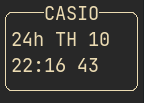

# Casio A168WA

This is an implementation of the classic Casio A168WA vintage digital clock which is a successor to the Casio F-91W. It's just a hobby project but I try to make the simulator as close as the original clock as possible.

